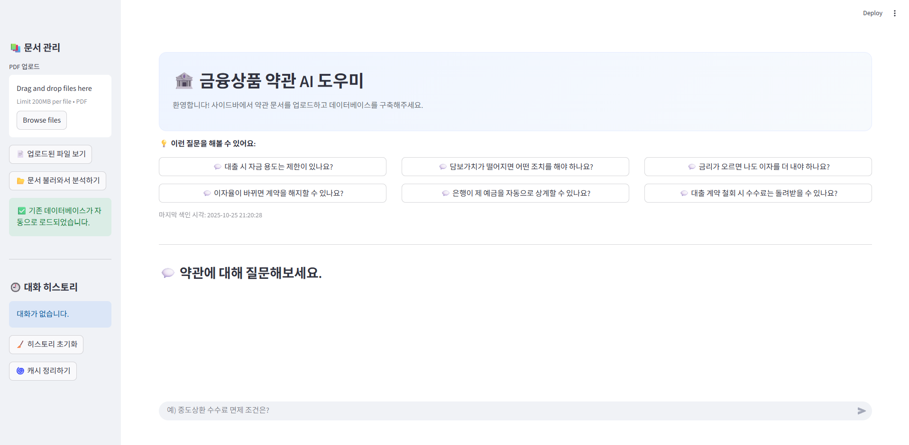

# 📘 프로젝트 개요

이 프로젝트는 **RAG (Retrieval-Augmented Generation)** 구조를 활용하여
**PDF 기반 금융 약관 문서에서 정보를 검색하고 요약 답변을 생성하는 Streamlit 웹 챗봇** 입니다.

사용자가 업로드한 약관 PDF 파일을 벡터화하여 데이터베이스에 저장하고,
자연어로 질문을 입력하면 관련 문서를 검색하여 LLM이 근거 기반 답변을 생성합니다.

본 프로젝트는 **LangChain 프레임워크**와 **Upstage Solar API**를 사용해 구현되었으며,
추가적으로 **MMR(Maximal Marginal Relevance)** 알고리즘을 활용한
문서 재순위화(Reranking) 기능을 포함하였습니다.

## ⚙️ 설치 및 실행 방법

### 1️⃣ 환경 설정

```
python -m venv venv
source venv/bin/activate   # (Windows: venv\Scripts\activate)
pip install -r requirements.txt
```


### 2️⃣ 실행
```
bash run.sh
```

### 3️⃣ 실행 후 과정


- PDF 파일을 업로드합니다.

- **문서 불러와서 분석하기** 버튼을 눌러 임베딩을 생성하고 벡터DB를 구축합니다.

- 질문을 입력하면 **문서 검색 → 리랭킹 → 답변 생성**이 순서대로 진행됩니다.


## 💡 주요 기능 설명

### 1️⃣ PDF 처리 (`chunking.py`)

- PDF 내용을 PyPDFLoader로 로드하고, RecursiveCharacterTextSplitter로 텍스트를 분할했습니다.

- 금융 약관은 조항별로 구조화되어 있으므로, 조·장·관 단위로 청킹하기 위해 `financial_separators`를 추가했습니다.


**추가한 구분자 예시:**
```
financial_separators = [
   "\n\n제\s*\d+\s*[조|장|관]\s*\(.+\)", # 예: "제 1 조 (목적)" 형태
   "\n\n제\s*\d+\s*[조|장|관]",          # 예: "제 1 조" 형태
   "\n\n",                             # 일반적인 단락 구분자
   "\n",                               # 줄 바꿈
   " ",                                # 공백
   "",
]
```


### 2️⃣ 임베딩 및 벡터DB (`embedding.py`)

- Upstage 임베딩 API를 이용하여 문서를 벡터화했습니다.

- 문서 임베딩 결과를 로컬 ChromaDB에 저장하여 검색 시 빠르게 접근할 수 있도록 구현했습니다.

### 3️⃣ 검색 및 리랭킹 (`retriever.py`, `reranker.py`)

- 기본적으로 유사도 기반 검색을 통해 Top-K 문서를 추출했습니다.

- 이후 MMR 기반 리랭킹(Reranking) 을 적용하여 더 관련도 높은 문서가 상위에 오도록 정렬했습니다.
    1. LLM 기반 점수 평가 – Upstage Chat 모델(`solar-pro-2`)을 이용하여 각 문서의 관련도를 0~100점으로 평가.

    2. MMR 적용 – 관련성(Relevance)과 다양성(Diversity)을 함께 고려해 중복 문서를 줄이고 핵심 문서를 상위에 배치.

    3. 임베딩 유사도 계산 – 문서 간 코사인 유사도를 계산하여 정보 중복도를 측정.


### 4️⃣ 질의응답 (`app.py`)

- Streamlit UI를 통해 사용자 질문을 입력받고,
- RAG 파이프라인을 거쳐 LLM이 답변을 생성합니다.
ㄹ

## 📎 참고 기술 스택

- **LLM:** Upstage Solar Pro 2

- **Embeddings:** solar-embedding-1-large-passage

- **Vector DB:** ChromaDB

- **Framework:** LangChain

- **Frontend:** Streamlit

- **Language:** Python 3.12

